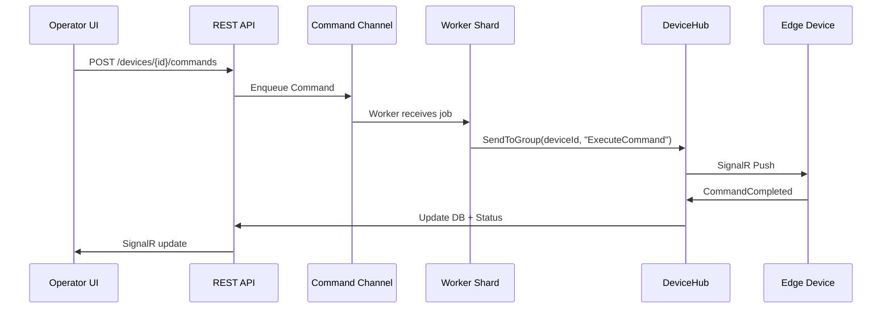
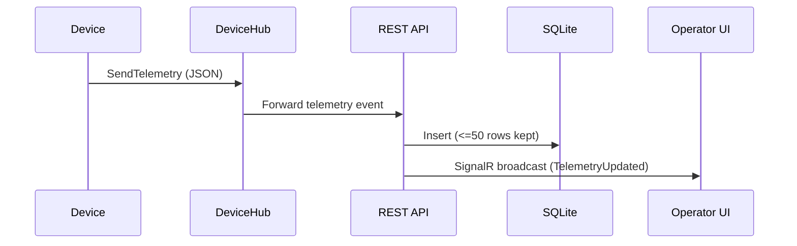

# 🚀 **FINAL ARCHITECTURE.MD**

````md
# System Architecture

Mini Monitoring & Management Platform — Secure Edge Edition

This document describes the internal design of the system, including:

- Command pipeline
- SignalR communication flows
- Concurrency model
- Idempotency
- API security
- Device simulation
- Notes on stretch-goal features

The goal is to illustrate production-grade architectural awareness, even where features are partially implemented due to timebox.

---

# 🧱 Architectural Boundary Note

Due to the 16–20 hour challenge timebox, the solution uses **folder-based Clean Architecture**, not multiple class library projects.  
Despite this, the boundaries remain clear:

- `/Domain` → Entities + value objects
- `/Application` → Use cases + interfaces
- `/Infrastructure` → EF Core + adapters
- `/Api` → Controllers + DI

In a production Cyviz system, these would be split into independent projects or deployable packages.

---

# 📐 1. High-Level System Diagram (Mermaid)

```mermaid
flowchart LR

OperatorUI(["Operator UI (React)"])
Api[[REST API (.NET)]]
ControlHub{{"SignalR Control Hub"}}
DeviceHub{{"SignalR Device Hub"}}
Workers[["Sharded Command Workers\n(consistent hashing)"]]
Channels[/"Bounded Channels\n(size=50)"/]
SQLite[(SQLite DB)]
EdgeClients(["Simulated Edge Devices\n(SignalR outbound only)"])

OperatorUI <-- SignalR --> ControlHub
OperatorUI <-- REST --> Api

Api --> Channels
Channels --> Workers
Workers --> DeviceHub
DeviceHub <-- SignalR --> EdgeClients

EdgeClients -->|"Telemetry"| DeviceHub --> Api
Api --> SQLite
```
````

---

# 🌐 NAT / Firewall Traversal

Devices establish **outbound-only** SignalR connections to `/hubs/device`.

This guarantees:

- No inbound TCP required
- No port forwarding
- Works behind enterprise firewalls
- Stable reconnect with exponential backoff
- Enables cloud-hosted control backend

This mirrors real-world Cyviz deployments in secure private networks.

---

# 🔁 2. Communication Flows

## 2.1 Command Flow (Operator → Device)



**Key aspects:**

- Commands idempotent on `(deviceId, idempotencyKey)`
- Workers sharded by device ID
- Each shard has a bounded channel (size 50)
- If full → **429 Retry-After**

---

## 2.2 Telemetry Flow (Device → Server → UI)



---

## 2.3 Device Connection Lifecycle

- Device initiates outbound SignalR connection
- Never inbound → NAT-friendly
- Reconnect with exponential backoff (max 10s)
- Heartbeat every 5 seconds
- Offline >30s → mark device Offline

---

# 🔐 3. Security Model

## 3.1 API Key Authentication

| Caller      | Header         | Purpose                                  |
| ----------- | -------------- | ---------------------------------------- |
| Operator UI | `X-Api-Key`    | Allows commands, queries, telemetry view |
| Device Edge | `X-Device-Key` | Allows telemetry push + receive commands |

Middleware:

- Validates key
- Tags caller as `Operator` or `Device`
- Rejects unknown types

## 3.2 Why It Works Behind Firewalls

Because the device:

- Opens _outbound_ WebSocket connections only
- No inbound ports required
- Works in corporate locked-down networks

---

# ⚙️ 4. Concurrency, Idempotency & Resilience

## 4.1 Sharded Workers

`workerIndex = hash(deviceId) % N`

Benefits:

- Ordering per device
- No locks
- Natural load spreading

---

## 4.2 Bounded Channels

Each worker uses:

```
Channel<DeviceCommand>(capacity: 50)
```

When full:

- API returns **429 Too Many Requests**
- Includes `Retry-After` header

Prevents memory pressure & overload.

---

## 4.3 Circuit Breaker (Partially Implemented)

State machine:

```
Closed → (5 failures) → Open → (10s) → Half-Open → Closed
```

- Open: reject commands immediately
- Telemetry still accepted

Implementation outline exists; full integration is future work.

---

## 4.4 Retry Policy (Fully Tested)

From unit tests:

- 3 attempts
- Bounded exponential backoff with jitter:
  - 100–200ms
  - 300–600ms
  - 700–1400ms
- Cancellable during delay
- Logs warnings
- Returns `false` after final failure

Ensures resilience to transient network/device issues.

---

## 4.5 Idempotency

Commands deduplicated via:

```
(deviceId, idempotencyKey)
```

Backed by database lookup.

Guarantees **exactly-once** command creation, even after reconnects.

---

# 🧩 5. Device Model & Persistence

### Device

- Tracks metadata
- Contains `rowVersion` for ETag
- Updated via `PUT` with `If-Match` header
- Violations → **412 Precondition Failed**

### DeviceTelemetry

- Max 50 entries/device
- Latest snapshot cached in memory

### DeviceCommand

- Tracks lifecycle
- Linked to idempotency key

SQLite used as lightweight, fast embedded storage.

---

# 🔌 6. Protocol Adapter Abstraction

Defined interface:

```csharp
public interface IDeviceProtocolAdapter {
    Task ConnectAsync(Device device, CancellationToken token);
    Task<CommandResult> SendCommandAsync(Device device, Command cmd, CancellationToken token);
    IAsyncEnumerable<Telemetry> StreamTelemetryAsync(Device device, CancellationToken token);
}
```

### Real-world targets

**Extron SIS**

- RS-232/Telnet
- Bracketed commands
- `]`-terminated responses

**Avocor Displays**

- 9600 baud RS-232
- Hex-framed packets

### Status

Adapters defined; real implementations out of scope for timebox.

---

# 🔭 7. Observability Notes

### OpenTelemetry

Not implemented — design includes:

- HTTP traces
- Worker pipeline spans
- SignalR event spans

### Metrics

Partially implemented:

- Command counts
- Failure counts
- Device online/offline

---

# ⚠️ 8. Chaos Engineering (Design-Level Only)

Environment flags:

```
CHAOS_LATENCY=1.0-2.0s
CHAOS_DROP_RATE=0.1
```

Planned integration points:

- Before command routing
- Before telemetry ingestion
- SignalR message layer

Stubs exist; full chaos behavior not implemented.

---

# 🗂️ 9. Notes on Architectural Approach

The solution mimics Clean Architecture boundaries but uses folders, not projects, because of time constraints.  
This preserves:

- Testability
- Separation of concerns
- Domain-first thinking

A production system would split these into individual class libraries.

---

# 📌 10. Remaining Work & Stretch Goals

| Feature                | Status             |
| ---------------------- | ------------------ |
| OpenTelemetry tracing  | ❌ Not implemented |
| Chaos injection        | ⚠️ Partial         |
| Extron/Avocor adapters | ⚠️ Interface-level |
| gRPC telemetry bridge  | ❌ Not implemented |
| Integration tests      | ⚠️ Partial         |
| Command outbox pattern | ❌ Not implemented |

---

# ✔️ Conclusion

This system demonstrates:

- Secure and NAT-friendly SignalR connectivity
- Real-time telemetry processing
- Resilient command routing
- Clear concurrency & idempotency guarantees
- A maintainable architecture aligned with Cyviz principles

Missing features are documented with clear upgrade paths for production.

```

---
```
